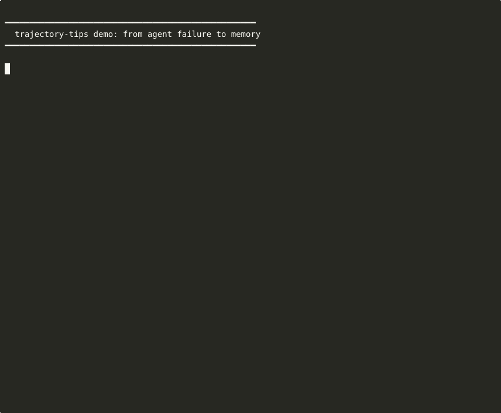

# trajectory-tips

[](https://github.com/adamkrawczyk/trajectory-tips/actions/workflows/ci.yml)
[](https://www.npmjs.com/package/trajectory-tips)
[](./LICENSE)

**Your AI agents keep making the same mistakes. Make them remember.**

Extract structured tips from agent failure trajectories → store as YAML with embeddings → inject into future prompts. No fine-tuning, no vector databases, no RAG pipelines. Just files.

Based on [Trajectory-Informed Memory Generation for Self-Improving Agent Systems](https://arxiv.org/abs/2603.10600) (IBM Research, Feb 2026).

<p align="center">
  
</p>

## Why?

AI agents fail. That's expected. What's *not* expected is failing the same way twice.

Most "agent memory" solutions involve vector databases, RAG pipelines, or fine-tuning. trajectory-tips takes a different approach:

1. **Extract** — Feed an agent's execution log. An LLM identifies what went wrong, what worked, and what was inefficient.
2. **Store** — Each tip becomes a YAML file with embeddings. Human-readable, git-diffable, hand-editable.
3. **Inject** — Before the next run, query relevant tips and inject them directly into the prompt.

The result: agents that learn from their own failures without any infrastructure beyond the filesystem.

## Install

```bash
npm install -g trajectory-tips
```

Or from source:

```bash
git clone https://github.com/adamkrawczyk/trajectory-tips.git
cd trajectory-tips && npm install && npm link
```

Requires Node ≥20 and an `OPENAI_API_KEY` for extraction and semantic search.

## 30-Second Quick Start

```bash
# 1. Extract tips from an agent's failure log
tips extract agent-session.md --domain devops

# 2. Before the next run, find relevant tips
tips query "deploying a docker container to production"

# 3. Get a prompt-ready section to inject
tips inject "Deploy the API to production" --max-tokens 1500

# 4. Track what works
tips feedback tip-20260317-abc123 success
```

That's it. Your agent now knows not to build ARM images for x86 servers.

## How It Works

```
Agent fails → execution log → tips extract → YAML tips + embeddings
                                                     ↓
Agent starts new task → tips inject → relevant tips in prompt → agent avoids past mistakes
```

Each tip is a standalone YAML file:

```yaml
id: tip-20260317-f33f46
category: recovery
priority: high
domain: devops
content: "Use docker buildx with --platform flag for cross-architecture deployments"
trigger: "When encountering 'exec format error' during container execution"
steps:
  - "Run: docker buildx build --platform linux/amd64 -t image:tag ."
  - "Verify with: docker inspect --format '{{.Architecture}}' image:tag"
negative_example: "Running docker build without --platform on ARM and deploying to x86"
effectiveness:
  applied_count: 3
  success_count: 3
```

## CLI Reference

| Command | What it does |
|---------|-------------|
| `tips extract <file>` | Analyze a trajectory and extract tips |
| `tips query <text>` | Semantic search over stored tips |
| `tips inject <text>` | Format relevant tips for prompt injection |
| `tips list` | List all tips with optional filters |
| `tips consolidate` | Merge duplicate/overlapping tips |
| `tips feedback <id> <outcome>` | Track tip effectiveness |
| `tips import <files...>` | Bulk extract from multiple files |
| `tips reindex` | Rebuild the embeddings index |
| `tips health` | Show effectiveness stats, find stale tips |
| `tips contrast <files...>` | Compare trajectories for contrastive tips |
| `tips analyze <file>` | Deep trajectory analysis without tip extraction |
| `tips seed` | Copy example tips into your tips directory |

### Extract

```bash
tips extract trajectory.md                     # From file
tips extract - < agent-output.log              # From stdin
tips extract log.md --domain devops            # Set domain tag
tips extract log.md --dry-run                  # Preview without saving
tips extract log.md --section "Deploy Fix"     # Specific section
```

### Query

```bash
tips query "docker deployment"                 # Semantic search
tips query "auth flow" --domain frontend       # Filter by domain
tips query "API errors" --top 10               # More results
tips query "deploy" --json                     # JSON output
```

### Inject

```bash
tips inject "Fix broken deployment"            # Default format
tips inject "Build API" --max-tokens 1500      # Token budget
tips inject "Debug auth" --focus recovery      # Category focus
```

Output is a ready-to-paste prompt section:

```
## Relevant Learnings from Past Executions

[PRIORITY: HIGH] Recovery Tip:
When deploying systemd services, always include ExecStartPre to kill stale port processes.
Apply when: Creating or updating systemd service files
Steps:
1. Add ExecStartPre=-/usr/bin/fuser -k PORT/tcp
2. Use dash prefix so fuser failure doesn't block startup
Avoid: Relying on application-level port conflict handling
```

## Multi-Provider Support

trajectory-tips works with OpenAI, OpenRouter, or Google Gemini:

| Provider | Set these env vars | Default extraction model | Default embedding model |
|----------|-------------------|-------------------------|------------------------|
| OpenAI | `OPENAI_API_KEY` | gpt-4o-mini | text-embedding-3-small |
| OpenRouter | `OPENROUTER_API_KEY` | google/gemini-2.0-flash-001 | openai/text-embedding-3-small |
| Gemini | `GEMINI_API_KEY` | gemini-2.0-flash | text-embedding-004 |

Override with `TIPS_MODEL` and `TIPS_EMBEDDING_MODEL`.

## Paper vs Implementation

Based on [Fang et al. 2026](https://arxiv.org/abs/2603.10600). This table shows what we implement, what's planned, and where we went beyond the paper.

| Paper Concept | Status | Notes |
|---------------|--------|-------|
| **Phase 1: Trajectory Analysis** | | |
| Trajectory Intelligence Extractor | ✅ Implemented | `analyzer.js` — parses logs into structured steps, classifies thought types (analytical, planning, validation, reflection, self-correction) |
| Decision Attribution Analyzer | ✅ Implemented | LLM-based causal analysis: immediate cause → proximate cause → root cause chain |
| Three tip categories (strategy/recovery/optimization) | ✅ Implemented | Extraction prompt generates all three types with structured fields |
| Subtask-level decomposition | ⚡ Partial | Subtask phases are extracted and displayed, but not yet used for cross-task clustering ([#3](https://github.com/adamkrawczyk/trajectory-tips/issues/3), [#5](https://github.com/adamkrawczyk/trajectory-tips/issues/5)) |
| **Phase 2: Storage & Management** | | |
| YAML tip storage with embeddings | ✅ Implemented | Flat files + JSON index, human-editable |
| Deduplication (cosine similarity threshold) | ✅ Implemented | 0.80 threshold, checked on save |
| LLM-based tip merging/consolidation | ✅ Implemented | `tips consolidate` — clusters similar tips, merges via LLM |
| Provenance tracking (tip → source trajectory) | ✅ Implemented | Every tip stores `source.trajectory_id`, `source.outcome`, `source.description` |
| Subtask-level clustering for cross-task transfer | 🔲 Planned | [#3](https://github.com/adamkrawczyk/trajectory-tips/issues/3) |
| **Phase 3: Runtime Retrieval** | | |
| Cosine similarity retrieval | ✅ Implemented | `tips query` and `tips inject` — semantic search with effectiveness weighting |
| Priority-based ranking | ✅ Implemented | High > medium > low priority, combined with similarity score |
| Metadata filtering (domain, category) | ✅ Implemented | `--domain`, `--focus` flags |
| LLM-guided retrieval (re-ranking) | 🔲 Planned | [#1](https://github.com/adamkrawczyk/trajectory-tips/issues/1) |
| **Novel (beyond the paper)** | | |
| Contrastive trajectory analysis | 🆕 Novel | `tips contrast` — compare two trajectories, extract tips from their *differences* |
| Effectiveness feedback loop | 🆕 Novel | `tips feedback` + `tips health` — track which tips actually work, auto-demote failures |
| Lexical fallback (no API key needed for query) | 🆕 Novel | Keyword matching when embeddings unavailable |
| Multi-provider support | 🆕 Novel | OpenAI, OpenRouter, Gemini — paper assumes single provider |
| Token-budgeted injection | 🆕 Novel | `tips inject --max-tokens` — fits tips within prompt limits |
| Base tip seeding | 🆕 Novel | `tips seed` — bootstrap from example tips |
| Text deduplication on input | 🆕 Novel | Handles messy agent logs with repeated sections |
| Dry-run mode | 🆕 Novel | Preview extraction without saving |

### What's not implemented yet

These are tracked as issues — contributions welcome:

- **LLM-guided retrieval** ([#1](https://github.com/adamkrawczyk/trajectory-tips/issues/1)) — Re-rank retrieved tips using an LLM when cosine similarity is ambiguous
- **Cross-agent coordinated learning** ([#2](https://github.com/adamkrawczyk/trajectory-tips/issues/2)) — Merge tips across multiple agents with conflict resolution
- **Subtask clustering** ([#3](https://github.com/adamkrawczyk/trajectory-tips/issues/3)) — Cluster tips by abstract subtask for cross-task transfer
- **Trajectory fingerprinting** ([#4](https://github.com/adamkrawczyk/trajectory-tips/issues/4)) — Runtime early warning when current execution matches a known failure pattern
- **Multi-granularity retrieval** ([#5](https://github.com/adamkrawczyk/trajectory-tips/issues/5)) — Task-level vs subtask-level tip retrieval
- **Tip provenance validation** ([#6](https://github.com/adamkrawczyk/trajectory-tips/issues/6)) — Verify that tips actually prevent the failures they were extracted from
- **Knowledge graph bridge** ([#7](https://github.com/adamkrawczyk/trajectory-tips/issues/7)) — Bidirectional sync with graph databases
- **Execution replay simulation** ([#8](https://github.com/adamkrawczyk/trajectory-tips/issues/8)) — Pre-flight check against stored tips before execution
- **Confidence scoring** ([#9](https://github.com/adamkrawczyk/trajectory-tips/issues/9)) — Score tip quality based on extraction source

## Design Decisions

- **YAML files** — Human-readable, git-diffable, hand-editable. No database needed.
- **Flat JSON embeddings** — Cosine similarity over hundreds of tips is <1ms. No vector DB.
- **Effectiveness tracking** — Tips that don't help get pruned. Tips that work get prioritized.
- **Provenance** — Every tip links back to the trajectory that created it.
- **Lexical fallback** — `tips query` works without an API key using keyword matching.
- **Contrastive analysis** — Compare two trajectories to find what one did right and the other didn't.

## Integration Examples

### With any agent framework

```bash
# Before running your agent, inject tips into the system prompt
TIPS=$(tips inject "the task description" --max-tokens 1000)
SYSTEM_PROMPT="You are a helpful assistant.\n\n$TIPS"

# After the agent finishes, extract new tips
tips extract agent-output.log --domain coding
```

### With CI/CD

```bash
# In your pipeline: learn from failures
if [ $? -ne 0 ]; then
  tips extract build.log --domain ci
fi
```

### As a cron job

```bash
# Nightly: extract tips from today's agent logs
tips import ~/logs/agents/$(date +%Y-%m-%d)*.md --domain general
tips consolidate  # merge duplicates
```

## Contributing

See [CONTRIBUTING.md](CONTRIBUTING.md). Fork, branch, test, PR.

## License

MIT — see [LICENSE](LICENSE).
